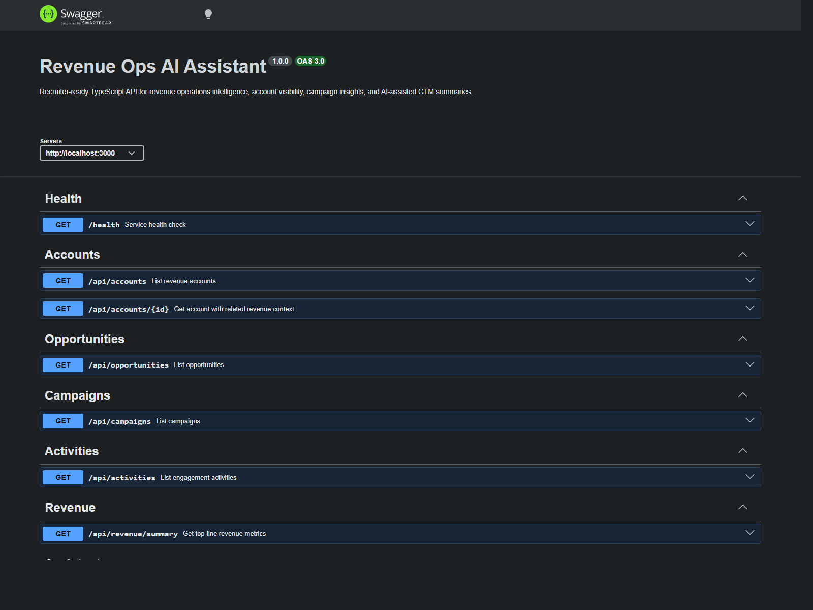
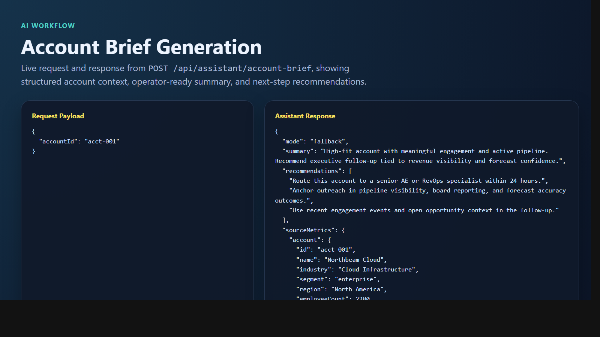
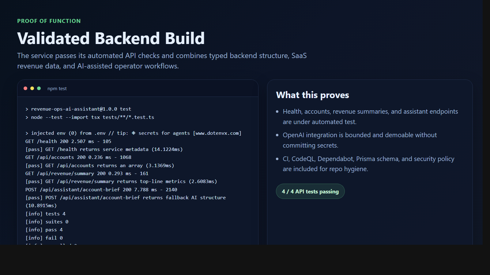

# Revenue Ops AI Assistant

> **TypeScript + Node.js + PostgreSQL + OpenAI portfolio project** demonstrating revenue intelligence APIs, SaaS data modeling, AI-assisted operator summaries, and production-minded backend structure for GTM workflows.

**Recruiter takeaway:** *"This person can connect backend engineering, data modeling, and AI-assisted business workflows into something revenue teams would actually use."*

---

## Project Overview

| Attribute | Detail |
| --- | --- |
| **Runtime** | Node.js 20+ |
| **Language** | TypeScript |
| **Framework** | Express |
| **Database** | PostgreSQL + Prisma schema |
| **AI Layer** | OpenAI with structured fallback mode |
| **Domain** | B2B SaaS Revenue Operations |
| **Core Workflows** | Account briefs · Pipeline summaries · Campaign insights |

---

## Service Architecture

```text
accounts ───────── contacts
   │
   ├──────── opportunities
   ├──────── activities
   └──────── revenue snapshots

campaigns ──────── activities

structured revenue data
        │
        ▼
assistant endpoints
        │
        ▼
AI summary + operator recommendation
```

### Core Components

| Component | Purpose | Key Files |
| --- | --- | --- |
| `api` | Middleware, routing, OpenAPI docs, error handling | `src/app.ts`, `src/server.ts` |
| `data model` | Structured SaaS revenue intelligence schema and seeds | `prisma/schema.prisma`, `db/seed.ts` |
| `assistant service` | Bounded OpenAI prompts with safe fallback summaries | `src/services/ai.ts` |
| `metrics` | Revenue and pipeline rollups for assistant inputs | `src/utils/metrics.ts` |
| `docs` | OpenAPI contract and architecture notes | `docs/openapi.yaml`, `docs/architecture.md` |
| `tests` | API validation for recruiter-visible paths | `tests/api.test.ts` |

---

## API Surface

| Method | Endpoint | Purpose |
| --- | --- | --- |
| `GET` | `/health` | Service health, uptime, timestamp, service name |
| `GET` | `/api/accounts` | Revenue account records |
| `GET` | `/api/accounts/:id` | Account bundle with contacts, activities, opportunities, revenue snapshots |
| `GET` | `/api/opportunities` | Pipeline opportunities |
| `GET` | `/api/campaigns` | Campaign performance records |
| `GET` | `/api/activities` | Engagement event stream |
| `GET` | `/api/revenue/summary` | Top-line revenue metrics |
| `POST` | `/api/assistant/account-brief` | AI-assisted account brief |
| `POST` | `/api/assistant/pipeline-summary` | AI-assisted pipeline summary |
| `POST` | `/api/assistant/campaign-insights` | AI-assisted campaign summary |
| `GET` | `/docs` | Swagger UI from OpenAPI spec |

---

## Business Problem

Revenue teams often have account context in CRM, activity detail in marketing systems, campaign influence in analytics, and pipeline status in separate reporting layers. That fragmentation makes it difficult to generate fast, trustworthy summaries for sales, growth, and RevOps operators.

## Solution

Revenue Ops AI Assistant packages structured SaaS operating data behind a clean API, then adds bounded AI endpoints that turn raw metrics into:

- account-level next-step briefs
- pipeline risk summaries
- campaign performance interpretations

This models a practical internal revenue intelligence service rather than a generic chatbot.

---

## Example AI Request

```json
{
  "accountId": "acct-001"
}
```

## Example AI Response

```json
{
  "mode": "fallback",
  "summary": "High-fit account with meaningful engagement and active pipeline. Recommend executive follow-up tied to revenue visibility and forecast confidence.",
  "recommendations": [
    "Route this account to a senior AE or RevOps specialist within 24 hours.",
    "Anchor outreach in pipeline visibility, board reporting, and forecast accuracy outcomes.",
    "Use recent engagement events and open opportunity context in the follow-up."
  ],
  "sourceMetrics": {
    "account": {
      "id": "acct-001",
      "name": "Northbeam Cloud"
    }
  }
}
```

---

## Getting Started

### Prerequisites

- Node.js 20+
- npm 10+
- PostgreSQL 15+ if you want to use the provided schema with a live database

### Setup

```bash
# 1. Clone the repo
git clone https://github.com/fknmiz/revenue-ops-ai-assistant.git
cd revenue-ops-ai-assistant

# 2. Install dependencies
npm install

# 3. Create local environment file
cp .env.example .env

# 4. Generate Prisma client
npx prisma generate

# 5. Start the API
npm run dev
```

### Seed the Database

```bash
npm run db:seed
```

### Run Tests

```bash
npm test
```

---

## Request Flow

```text
client request
   ↓
helmet / cors / logging / JSON parsing
   ↓
route handler
   ↓
structured revenue context
   ↓
assistant prompt packaging
   ↓
OpenAI summary or fallback summary
   ↓
JSON response
```

See [docs/architecture.md](./docs/architecture.md) for the deeper walkthrough.

---

## Screenshots

### Swagger UI



### AI Account Brief Workflow



### Validation Proof



This repo includes:

- Swagger UI hero capture
- AI account brief or pipeline summary workflow
- validation proof or schema/architecture proof

Assets will live in [`screenshots/`](./screenshots/).

---

## Key Design Decisions

| Decision | Rationale |
| --- | --- |
| **Structured AI endpoints** | Keeps prompts explainable and aligned to concrete operator tasks |
| **Fallback mode without API key** | Makes the project demoable even without live OpenAI credentials |
| **Prisma schema + seed data** | Demonstrates relational data modeling and operational domain thinking |
| **Bounded assistant outputs** | Uses AI for interpretation, not for authoritative metric calculation |
| **Separate metrics utility** | Keeps summary calculations deterministic and testable |
| **Portfolio-first API scope** | Balances realism with clarity for recruiters and technical reviewers |

---

## What This Demonstrates

| Capability | Evidence in Project |
| --- | --- |
| **Backend engineering** | Express app structure, TypeScript typing, centralized errors, routing |
| **Data modeling** | PostgreSQL schema with revenue, account, activity, and campaign entities |
| **AI product thinking** | Operator-ready OpenAI summaries with bounded prompts and fallback behavior |
| **Business systems thinking** | Revenue workflow framing across fit, intent, pipeline, and campaign influence |
| **Platform maturity** | OpenAPI docs, tests, CI, Dependabot, CodeQL, security policy |

---

## Security and Delivery Posture

- `helmet`, `cors`, and centralized JSON errors are enabled
- OpenAI integration is environment-driven and optional
- No secrets are committed
- GitHub Actions CI, Dependabot, CodeQL, and `SECURITY.md` are included

---

## Tech Stack


### Portfolio Links

- [LinkedIn](https://www.linkedin.com/in/mirzacausevic)
- [Skills Page](https://mizcausevic.com/skills/)
- [Medium](https://medium.com/@mizcausevic)
- [GitHub](https://github.com/fknmiz)

---

*Part of [fknmiz's GitHub portfolio](https://github.com/fknmiz) — demonstrating revenue intelligence architecture, AI-assisted operator workflows, and production-aware backend delivery.*
